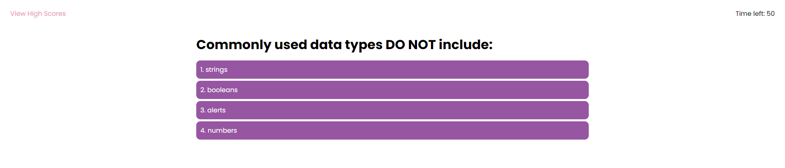

# Module #4 Challenge: JavaScript Code Quiz

## Description
This project is a **code quiz challenge**. This challenge involved creating an application that a student learning JavaScript can use to take a timed quiz on JavaScript fundamentals, and runs in the browser. This project features dynamically updated HTML and CSS powered by JavaScript. It has a clean and responsive interface, and a high scores list is saved in `localStorage`.

Implemented features:

* when the user clicks the start quiz button, a timer starts and they are presented with a question
* when the user answers a question, they are presented with another question
* when the user answers incorrectly, time is subtracted from the clock
* when all questions are answered or the timer reaches 0, the game is over, and the user can save their initials and score

In addition, I have also:

* deployed the live [URL](https://desguerra.github.io/code-quiz/)
* modified the application to resemble the mock-up functionality
* added a button to clear all of the scores in the high scores list
* added a link to take the user to the high scores list
* added a button to restart the game when viewing the high scores list

Here is the link to [the completed challenge!](https://desguerra.github.io/code-quiz/)

## Table of Contents

* [Screenshots](#screenshots)
* [Badges](#badges)

## Screenshots

## Badges

